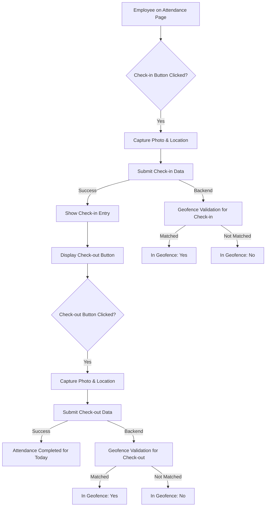

## 1. Product Overview
HR Management ke Attendance page mein ek naya feature, jismein employees photo aur location ke sath check-in aur check-out kar sakenge. Ismein geofencing validation bhi hoga taaki yeh verify kiya ja sake ki employee designated farm area ke andar hai ya nahi. Iska maksad attendance tracking ko accurate aur reliable banana hai.

## 2. Core Features

### 2.1 User Roles
- **Employee**: Check-in/Check-out with photo aur location.
- **HR/Manager**: Employee attendance records view kar sakte hain, jismein "In Geofence" status bhi shamil hoga.

### 2.2 Feature Module
1. **Attendance Page**: Employee check-in/check-out functionality.
2. **Attendance Records Display**: Admin/Manager ke liye attendance records ka view, jismein naya "In Geofence" column hoga.

### 2.3 Page Details
| Page Name | Module Name | Feature description |
|---|---|---|
| Attendance Page | Check-in/Check-out UI | Check-in button, jo submit hone ke baad check-out button mein badal jayega. Photo aur location capture ka UI. |
| Attendance Records | Table Column | Naya "In Geofence" column jo display karega "Yes" ya "No" based on geofence validation. |

## 3. Core Process

User ka main flow yeh hoga:
1. Employee Attendance Page par jayega.
2. "Check-in" button par click karega.
3. Photo aur Location capture karega.
4. Submit button par click karega.
5. Successful submission ke baad, "Check-in" entry show hogi aur button "Check-out" mein badal jayega.
6. Employee apna kaam khatam karne ke baad "Check-out" button par click karega.
7. Photo aur Location capture karega.
8. Submit button par click karega.
9. Successful submission ke baad, attendance complete show hogi aur "Aaj ki attendance ho gayi hai" jaisa message dikhega.
10. Backend mein, har check-in/check-out entry ke liye GPS coordinates ko farm ke geofence (Center Lat / Lng) se compare kiya jayega.
11. Agar coordinates geofence ke andar hain, toh "In Geofence" status "Yes" hoga, warna "No".

## 4. User Interface Design

### 4.1 Design Style
- Existing UI theme aur components ka use hoga.
- Buttons (Check-in, Check-out) clear aur prominent honge.
- Photo capture aur location display ke liye intuitive UI elements.

### 4.2 Page Design Overview
| Page Name | Module Name | UI Elements |
|---|---|---|
| Attendance Page | Main Content Area | "Check-in" button (dynamically changes to "Check-out"), photo/location capture modal/inline form, "Aaj ki attendance ho gayi hai" message. |
| Attendance Records | Table | Column for "In Geofence" with "Yes"/"No" badges. |

### 4.3 Responsiveness
Desktop-first approach, mobile-adaptive design. Attendance page aur controls touch-friendly honge.