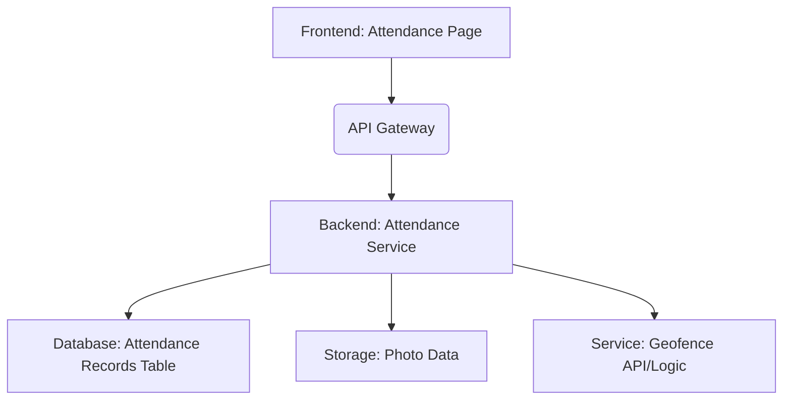
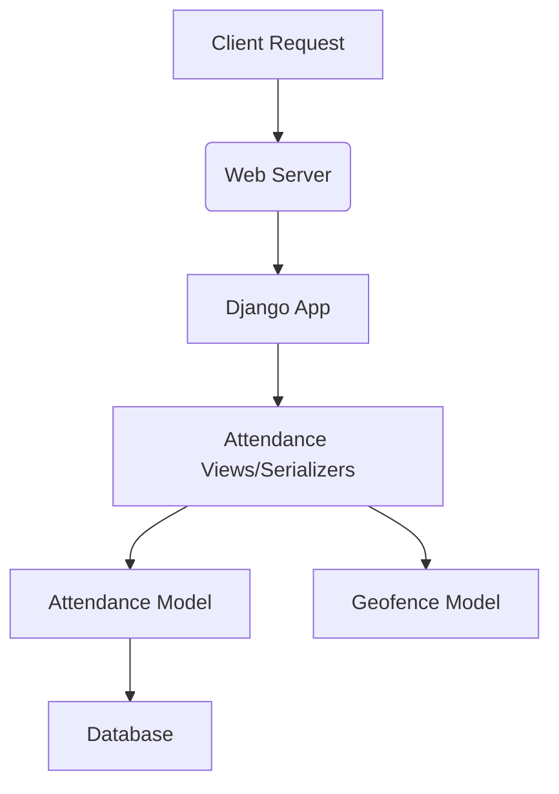

## 1. Architecture Design



## 2. Technology Description
- Frontend: React@18 + tailwindcss@3 + vite (Existing project setup ke according adjust hoga)
- Location API: Browser's Geolocation API
- Photo Capture: HTML5 Media Devices API (`getUserMedia`) ya existing component.
- Backend: Django REST Framework.
- Geofence Logic: Backend mein implement hoga, jo farm ke `Geofence` model se data fetch karega. `haversine_m` function ka use karke distance calculate hoga.

## 3. Route Definitions
| Route | Purpose |
|---|---|
| `/attendance` | Employee attendance page |
| `/api/attendance/checkin` | API endpoint for employee check-in |
| `/api/attendance/checkout` | API endpoint for employee check-out |
| `/api/attendance/records` | API endpoint for fetching attendance records |

## 4. API Definitions
- **POST `/api/attendance/checkin`**:
    - Request: `{ photoUrl: string, latitude: number, longitude: number }`
    - Response: `{ status: 'success', message: 'Check-in successful', attendanceRecord: { ... } }`
- **POST `/api/attendance/checkout`**:
    - Request: `{ photoUrl: string, latitude: number, longitude: number }`
    - Response: `{ status: 'success', message: 'Check-out successful', attendanceRecord: { ... } }`
- **GET `/api/attendance/records`**:
    - Response: `[{ id: string, user: string, check_in_time: datetime, check_out_time: datetime, in_geofence_ci: boolean, in_geofence_co: boolean, ... }]`

## 5. Server Architecture Diagram
[Assuming a standard Django REST Framework setup.]



## 6. Data Model

### 6.1 Data Model Definition

```mermaid
erDiagram
    EMPLOYEE {
        string id PK
        string name
        ...
    }
    FARM {
        string id PK
        string name
        float center_lat
        float center_lng
        ...
    }
    GEOFENCE {
        string id PK
        string farm_id FK
        float center_lat
        float center_lng
        float radius_m
        ...
    }
    ATTENDANCE_RECORD {
        string id PK
        string employee_id FK
        string farm_id FK
        datetime check_in_time
        float check_in_lat
        float check_in_lng
        string check_in_photo_url
        boolean in_geofence_ci
        datetime check_out_time
        float check_out_lat
        float check_out_lng
        string check_out_photo_url
        boolean in_geofence_co
        string status
        date record_date
    }
    EMPLOYEE ||--o{ ATTENDANCE_RECORD : "has"
    FARM ||--o{ GEOFENCE : "has"
    FARM ||--o{ ATTENDANCE_RECORD : "for"
```

### 6.2 Data Definition Language
[Example DDL for a PostgreSQL database]

```sql
CREATE TABLE attendance_record (
    id UUID PRIMARY KEY DEFAULT gen_random_uuid(),
    employee_id UUID NOT NULL REFERENCES auth_user(id), -- Assuming auth_user for employees
    farm_id UUID NOT NULL REFERENCES farms_farm(id),
    check_in_time TIMESTAMP WITH TIME ZONE,
    check_in_lat DECIMAL(9,6),
    check_in_lng DECIMAL(9,6),
    check_in_photo_url TEXT,
    in_geofence_ci BOOLEAN DEFAULT FALSE,
    check_out_time TIMESTAMP WITH TIME ZONE,
    check_out_lat DECIMAL(9,6),
    check_out_lng DECIMAL(9,6),
    check_out_photo_url TEXT,
    in_geofence_co BOOLEAN DEFAULT FALSE,
    status VARCHAR(50) NOT NULL DEFAULT 'pending', -- 'checked_in', 'completed'
    record_date DATE NOT NULL,
    created_at TIMESTAMP WITH TIME ZONE DEFAULT CURRENT_TIMESTAMP,
    updated_at TIMESTAMP WITH TIME ZONE DEFAULT CURRENT_TIMESTAMP,
    UNIQUE(employee_id, record_date) -- One attendance record per employee per day
);
```